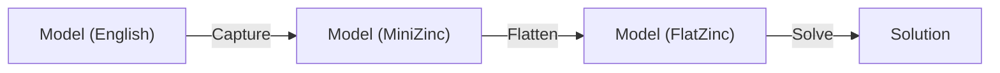
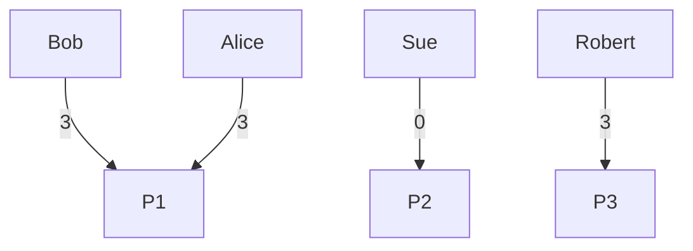

# Simple Team Assignment



An example simple problem/solution

## Problem

We have some PERSONs and some PROJECTs, and some preferences for each PROJECT for each PERSON is represented by a PRIORITY. Each PROJECT has a min and max requirement for number of PERSONs. We want to maximise the sum of satisfied PRIORITYs.

## Solution

```text
Compiling team-assignment.mzn, with additional data team-assignment.dzn
Running team-assignment.mzn
[P2, P3, P1, P1], 5 = [1, 0, 1, 3]
----------
[P3, P2, P1, P1], 6 = [2, 0, 1, 3]
----------
[P1, P3, P2, P1], 7 = [3, 0, 1, 3]
----------
[P1, P2, P3, P1], 9 = [3, 0, 3, 3]
----------
==========
```


